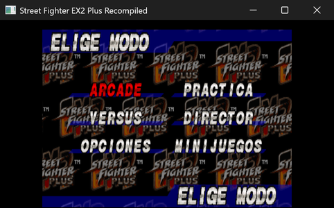
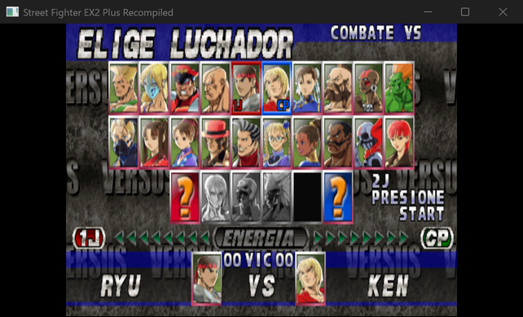
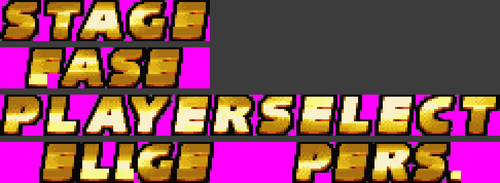
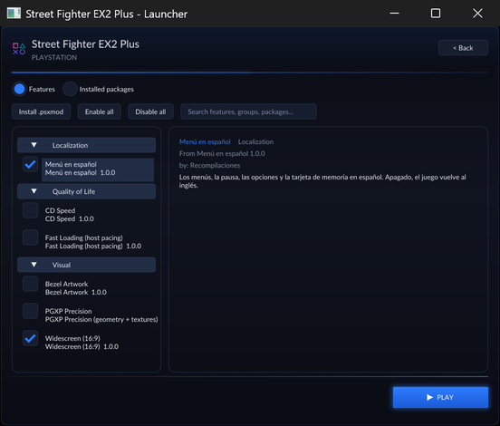

# Street Fighter EX2 Plus en español

Traducción al español de *Street Fighter EX2 Plus* (PlayStation, 1999, `SLUS-01105`) para la
recompilación estática [PSXRecomp](https://github.com/mstan). Va como **paquete de mods
declarativo**: 302 textos, 979 parches comprobados, sin tocar la imagen del disco y sin
ejecutable parcheado. Se enciende y se apaga en el lanzador.

*(English: [README.md](README.md))*



## Qué está en español

- El título y las cargas, el menú principal y sus submenús, las opciones de juego y de sonido,
  la tarjeta de memoria, la base de datos, la clasificación, los resultados y la pausa, tanto
  del combate como del entrenamiento.
- **La pantalla de versus, entera**: el puntero de la rejilla y la placa de la barra dicen
  **1J** y **2J**, la barra dice **ENERGIA**, el marcador **00 VIC 00** y el aviso del segundo
  jugador, **2J PRESIONE START**.
- Los dos rótulos dorados del arcade, **compuestos con las letras del propio juego** para que
  no desentonen: **FASE 1** (2, 3…) en vez de «STAGE 1» antes de cada pelea, y **ELIGE PERS.**
  en vez de «PLAYER SELECT» al elegir luchador.





Se queda en inglés lo que es nombre propio o está dibujado: luchadores, escenarios, músicas y
golpes; la jerga del marcador (HIT, DAMAGE, TOTAL…); y **CP**, el lado de la máquina, que vale
igual para «computadora».

La letra de los menús no tiene tildes ni eñe: las tildes se pliegan («PRACTICA») y las
palabras que pedían eñe se cambiaron por otras en vez de escribirlas mal («FUERZA DE GOLPE»,
no «DANO»). La letra de la tarjeta de memoria sí las tiene, y las usa. Las decisiones de
traducción, una por una, están en [docs/TRANSLATION.es.md](docs/TRANSLATION.es.md).

## Cómo funciona

Es un paquete declarativo `format_version = 5`. Cada parche lleva anotados los bytes
originales que espera encontrar, y el paquete entero está atado al SHA-256 del disco:

- **938 parches al disco** (`target = "disc_user"`), porque este juego guarda sus textos de
  interfaz como cadenas ASCII dentro de los módulos que carga para cada pantalla, y los
  recarga cada vez. La imagen original **no** se reescribe: el runtime los resuelve como una
  capa dispersa al cargar.
- **41 parches al ejecutable** (`target = "main_exe"`), aplicados en la RAM antes del punto de
  entrada, para los avisos del arranque y de la configuración de botones.

Si el disco no es aquel para el que se generó el paquete, no se aplica nada: falla del lado
seguro en vez de romper el juego.

## Qué NO hay en este repositorio

**Ni código del juego, ni imagen del disco, ni BIOS, ni ejecutable compilado.** Hace falta tu
propia copia volcada del juego y un proyecto PSXRecomp funcionando. Lo que hay aquí es un
parche: los bytes que cambian y los bytes que cada cambio espera encontrar.

## Instalación

Se copia la carpeta del paquete al proyecto del juego, junto al ejecutable:

```
mods/packages/sfex2p.es/1.0.0/manifest.toml
```

Se arranca el juego y se enciende **Menú en español** en **Mods → Localization**. Paso a paso,
y en consolas, en **[docs/INSTALL.es.md](docs/INSTALL.es.md)**.



## Relacionado

- [sfex2p-widescreen](https://github.com/jajdp/sfex2p-widescreen) — 16:9 de verdad para el
  mismo juego, con el fondo del escenario dibujado hasta los bordes. Es independiente de este
  mod; los dos funcionan a la vez.

## Estado

Recorrido pantalla por pantalla en Windows y en una Xbox Series en modo desarrollador. Lo que
falta: los finales del arcade, que no se han recorrido y donde puede quedar texto en inglés.

## Créditos y licencia

Traducción y herramientas de **Recompilaciones**. Publicado bajo la
[PolyForm Noncommercial License 1.0.0](LICENSE), la misma licencia del framework PSXRecomp
sobre el que corre.

*Street Fighter EX2 Plus* es © Capcom / Arika. Este proyecto no está afiliado a ellos, ni a
Sony, ni al autor de PSXRecomp, y no distribuye nada que les pertenezca.
