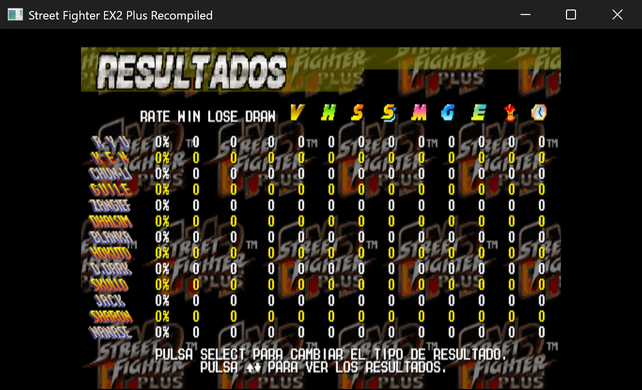

# Instalar el mod en español

*(English: [INSTALL.md](INSTALL.md))*

## Antes de empezar

Hace falta un proyecto PSXRecomp de Street Fighter EX2 Plus que ya funcione en tu máquina, y
tu propio volcado del disco NTSC-U.

Si todavía no tienes el juego funcionando, esa parte sale de
[strider973/Street-Fighter-EX2-Plus-Recompiled](https://github.com/strider973/Street-Fighter-EX2-Plus-Recompiled),
construido sobre el framework [PSXRecomp](https://github.com/RetroPortingToolKit/psxrecomp). Dos
cosas que ese proyecto necesita y que este mod no puede darte:

- **tu propio volcado del disco** (`.cue` / `.bin`), y
- **una BIOS retail SCPH-1001** — ese proyecto va con `openbios = false`, así que la OpenBIOS que
  viene incluida no sirve.

Primero el juego arrancando; después vuelve aquí. Instalar este paquete es el último paso, no
el primero.

El paquete está atado a ese volcado. Comprueba el tuyo antes que nada:

```
SHA-256  f12ab8cb7a7af9599fe805f3c1405a051f22810305d2005b107c042316aa936f
```

```powershell
# Windows
certutil -hashfile "Street Fighter EX2 Plus (USA).bin" SHA256
```

```sh
# Linux / macOS
sha256sum "Street Fighter EX2 Plus (USA).bin"
```

Si tu huella es otra, el mod no se aplicará. Mira *Si algo no sale bien*, más abajo.

## 1. Copiar el paquete

Copia la carpeta de modo que este archivo quede junto al ejecutable del juego:

```
<carpeta del juego>/mods/packages/sfex2p.es/1.0.0/manifest.toml
```

Y ya está: no hay nada que compilar ni que generar. No cambies el nombre de las carpetas: el
id y la versión del paquete **son** la ruta, y una carpeta renombrada hace que el runtime
rechace **todo** el catálogo, no solo ese paquete (`mods unavailable: package path does not
match manifest id/version`).

**Si compilas el juego desde el código fuente**, copia el paquete **después** de compilar, en
`build-*/mods/packages/`. El framework deja ahí su propio catálogo y limpia esa carpeta antes,
así que lo que copies antes de compilar se pierde. (Con
[sfex2p-widescreen](https://github.com/jajdp/sfex2p-widescreen) instalado puedes, en cambio,
guardar el paquete en el `mods/packages/` del propio proyecto: su instalador añade un paso
posterior a la compilación que copia esa carpeta junto al ejecutable, después del catálogo.)

## 2. Encenderlo

Arranca el juego. En el lanzador, en **Mods**, el grupo **Localization** trae ahora **Menú en
español**, encendido de fábrica. Pulsa **PLAY**.


## 3. Comprobarlo

El título tiene que decir **PULSA START**, y el menú, **ELIGE MODO**. Después:

| Pantalla | Qué se ve |
|---|---|
| Menú principal | **ELIGE MODO**, y entre las entradas PRACTICA, OPCIONES y MINIJUEGOS |
| Lista de modos | MODO ARCADE, MODO VERSUS, ENTRENAMIENTO, MODO DESAFIO, MODO DIRECTOR |
| Antes de pelear | **FASE 1** en el rótulo dorado, no «STAGE 1» |
| Elegir luchador | **ELIGE PERS.** en el rótulo dorado y **ELIGE LUCHADOR** como texto (son dos recursos distintos) |
| Pantalla de versus | punteros **1J** / **2J**, **ENERGIA** en la barra, **00 VIC 00** en el marcador y **2J PRESIONE START** |
| Pausa | SEGUIR JUGANDO, REPETIR, SALIR |
| Tarjeta de memoria | español con tildes: esa letra sí las tiene |



## 4. Apagarlo

Desmarca **Menú en español** en el lanzador: el juego vuelve al inglés en el acto, sin
reinstalar nada. Las partidas guardadas no se ven afectadas
(`save_compatibility = "shared"`).

Para quitarlo del todo, borra la carpeta `mods/packages/sfex2p.es/`.

## Consolas y otros empaquetados UWP

En una compilación UWP (por ejemplo una Xbox en modo desarrollador) el paquete no se instala
aparte: se copia dentro del paquete de la aplicación, junto al ejecutable, y viaja con él; el
runtime lo lleva a su carpeta de datos en cada arranque. Para actualizar la traducción se
instala una versión nueva del paquete de la aplicación.

## Si algo no sale bien

| Síntoma | Causa |
|---|---|
| La opción no aparece en el lanzador | El paquete no está junto al ejecutable, o le cambiaron el nombre a alguna carpeta. La ruta tiene que ser exactamente `mods/packages/sfex2p.es/1.0.0/manifest.toml`. |
| `mods unavailable: package path does not match manifest id/version` | Se renombró la carpeta de un paquete. Eso tumba **todos** los mods, no solo el renombrado. Devuélvele su nombre. |
| `cannot launch with selected mods: package does not target this game/image: sfex2p.es` | El juego no está usando **tu** imagen. O el volcado no es el NTSC-U `SLUS-01105` al que apunta el paquete, o el juego está mirando otro archivo: elige tu disco una vez en el lanzador (se recuerda) o pon tu `.cue` en `disc` dentro de `game.toml`. Arrancando con `--no-launcher`, los mods se resuelven **antes** que el `--disc` de la línea de comandos, así que ahí manda la ruta del `game.toml`. |
| Aparece pero no se deja encender | La huella del disco no coincide con `disc_sha256`: otro volcado, otra revisión u otra región. Este paquete es solo para el NTSC-U `SLUS-01105`. |
| Los menús están en español pero una pantalla sigue en inglés | O es a propósito (los nombres propios y los rótulos dibujados se quedan en inglés) o es una pantalla que no se recorrió: los finales del arcade están sin revisar. Se agradece el aviso. |
| Faltan tildes en los menús | Es a propósito: la letra de los menús no tiene tildes ni eñe. La de la tarjeta de memoria sí, y las usa. |
